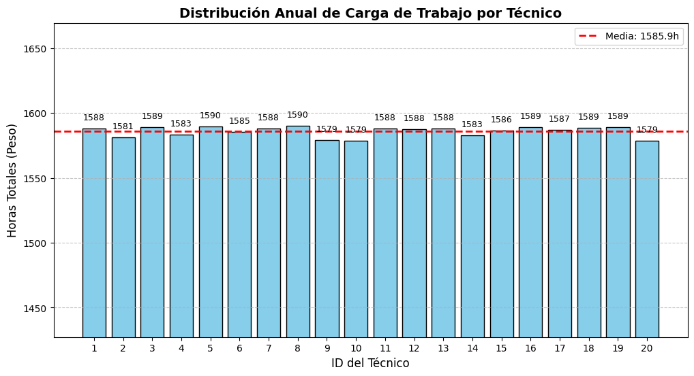
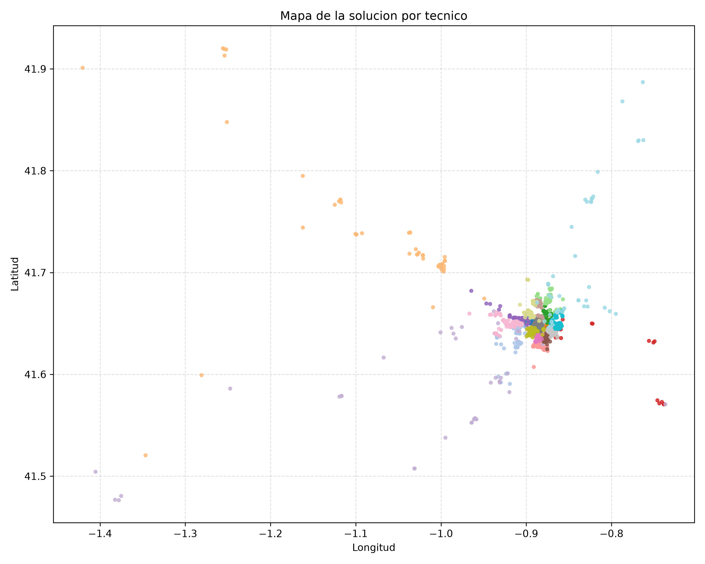

# Planificacion Logistica de Mantenimiento Preventivo

Proyecto de optimizacion para asignar instalaciones a tecnicos minimizando desplazamientos y equilibrando carga de trabajo anual.

## Problema a Resolver

Una empresa de mantenimiento preventivo debe repartir un conjunto grande de instalaciones entre 20 tecnicos.

Objetivos operativos:

- Eficiencia espacial: reducir la distancia total recorrida.
- Equidad: mantener una distribucion de horas lo mas equilibrada posible.

## Enfoque de Resolucion

La resolucion se hace con un enfoque hibrido en tres pasos:

1. Inicializacion con K-Means para proponer centros geograficos.
2. Asignacion MILP (PuLP) para optimizar distancia y balance.
3. Refinamiento ALA (Asignacion-Localizacion Alternante) para mejorar la calidad de la solucion.

Ademas, se evalua un frente de Pareto variando lambda para analizar compromisos entre distancia y equilibrio.

## Modelo Matematico

La formulacion completa (notacion, funcion objetivo y restricciones) esta documentada en [MODELO_MATEMATICO.md](MODELO_MATEMATICO.md).

## Estructura del Repositorio

- [logistica.py](logistica.py): pipeline principal de optimizacion.
- [MODELO_MATEMATICO.md](MODELO_MATEMATICO.md): formulacion del modelo.
- [instalaciones.csv](instalaciones.csv): datos de entrada.
- [requirements.txt](requirements.txt): dependencias de Python.

Archivos generados por la ejecucion:

- [solucion.csv](solucion.csv): asignacion final por tecnico.
- [resumen_balance.csv](resumen_balance.csv): resumen de carga por tecnico.
- [metricas_pareto.csv](metricas_pareto.csv): metricas del frente de Pareto.
- [soluciones_maestro_pareto.csv](soluciones_maestro_pareto.csv): asignaciones por lambda.
- [frente_pareto.png](frente_pareto.png): grafica Pareto.
- [balance_carga_tecnicos.png](balance_carga_tecnicos.png): grafica de balance.
- [evolucion_lambda_ganador.png](evolucion_lambda_ganador.png): evolucion por iteraciones.
- [mapa_solucion.png](mapa_solucion.png): mapa estatico de asignaciones por tecnico.
- [mapa_solucion.html](mapa_solucion.html): mapa interactivo.

## Instalacion

Se recomienda Python 3.10 o superior.

```bash
pip install -r requirements.txt
```

## Ejecucion

```bash
python logistica.py --data instalaciones.csv --output-dir . --solver auto
```

Ejemplo avanzado:

```bash
python logistica.py \
  --data instalaciones.csv \
  --output-dir resultados \
  --technicians 20 \
  --lambdas 0.1,0.2,0.3,0.4,0.5,0.6,0.7,0.8,0.9 \
  --max-iterations 3 \
  --balance-ratio 0.15 \
  --time-limit 60 \
  --solver auto
```

## Presentacion de Resultados

### Balance de carga

Distribucion de horas por tecnico:



### Mapa de la solucion

Mapa con colores por tecnico:



## Parametros Principales

- --technicians: numero de tecnicos.
- --lambdas: lista de pesos del objetivo separada por comas.
- --max-iterations: iteraciones maximas de ALA.
- --balance-ratio: tolerancia de equilibrio sobre carga media.
- --time-limit: limite de tiempo por MILP.
- --solver: auto, gurobi o cbc.
- --solver-log: activa log del solver.

## Notas de Publicacion

- El codigo no incluye credenciales ni configuracion academica.
- Si Gurobi no esta disponible, con solver auto se usa CBC.

## Licencia

Antes de publicar en GitHub, añade el archivo LICENSE (por ejemplo, MIT).
